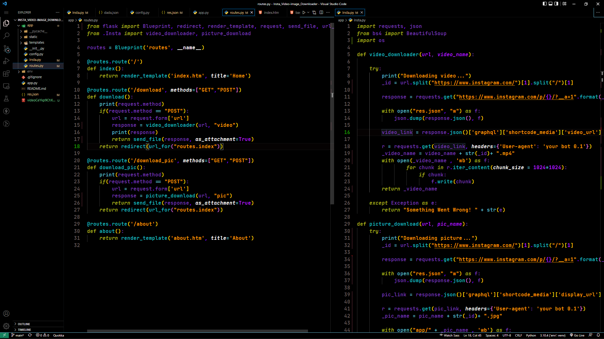
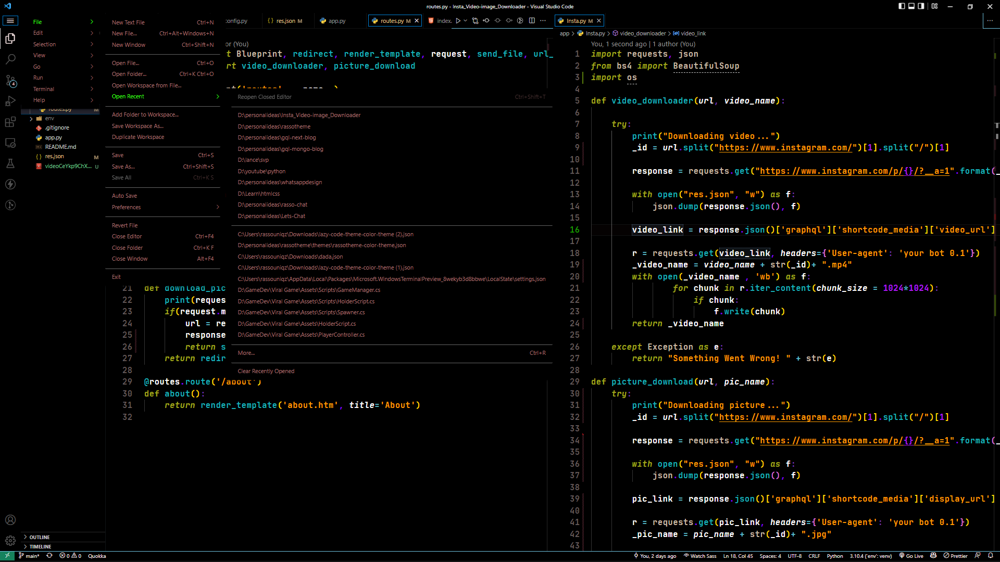
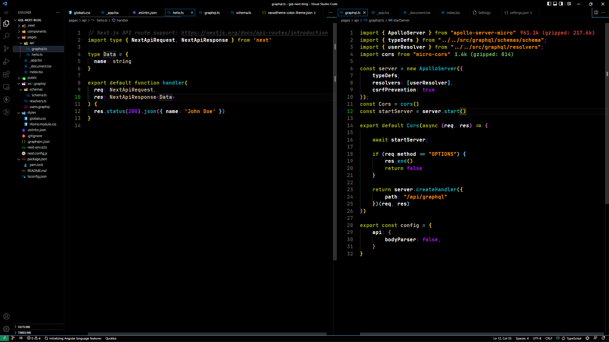

# Rasso-theme✨

### Hey There! I am Rasla, Self Taught Developer Based in India. I Love Dark And High Contrast Themes Very Much. I Dont Want to code in a terminal based editor Like Vim or Emacs. But i want the feel of terminal color schemes in my Favorite Editor. So I create My Own Theme.

### Chekout My Theme. I Hope you Love it (if your taste is similar to mine)🫠.

 

## Python

## Hover And Widgets

## Typescript / Javascript

# Installation

    1. Install Visual Studio Code
    2. Launch Visual Studio Code
    3. Choose the extension from menu
    4. Search for rassotheme
    5. Click on the extension and Install it
    6. Click Reload to reload vscode
    7. Click on the bottom right corner of the editor and choose "Color Theme" and Select "Rassotheme"
    8. Rate me if you like my theme.

# Misc

    I am a self taught developer. I Never Created a theme before. Its My first theme. The theme needs more changes and improvements. I am Sure there are things i missed

    If you have any suggestions or feedback, please let me know.The Source Code is available on [Github](https://github.com/0xrasla/rassotheme.git)

    Any Relevant Changes for each version are documented in the changelog.
    Please  update and check the changelog before filing any issues, as they may have already been taken care of.

### I Run a youtube channel called [Rasla's Youtube](https://www.youtube.com/c/Codingwithrasla). Make sure to subscribe.
